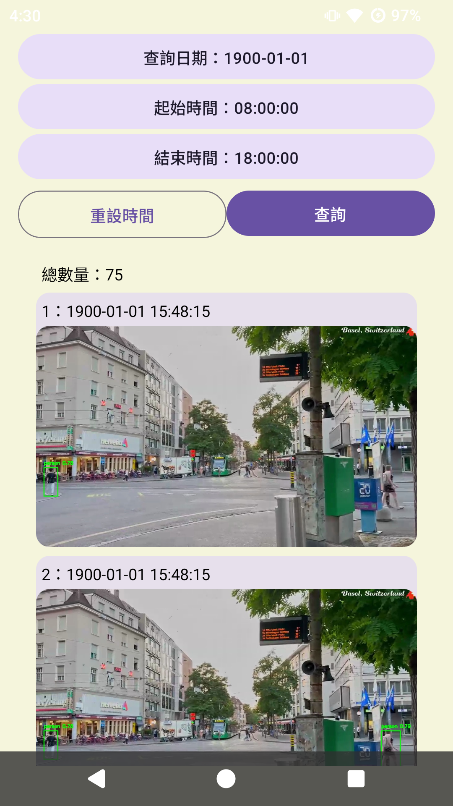
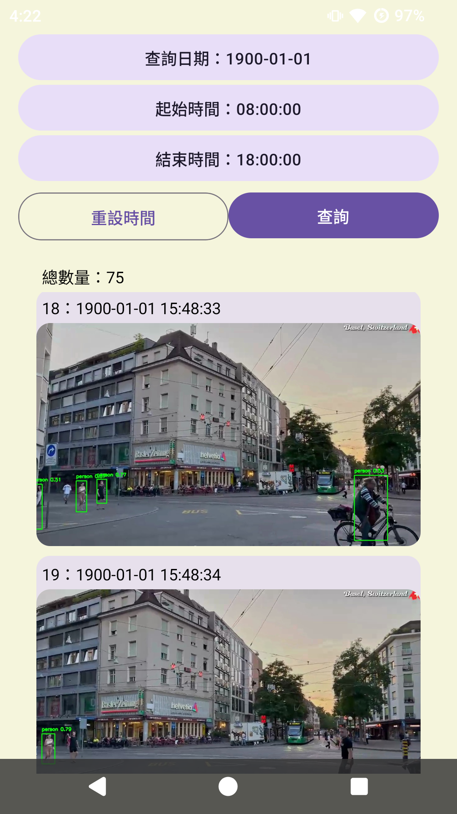
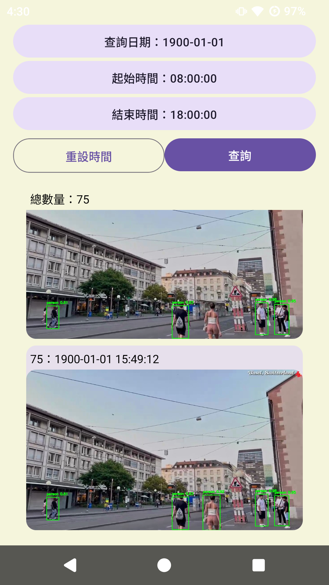

# Who Was Here 誰來過 Mobile App (React Native)

透過影像偵測技術，讓住戶能快速查詢「曾出現在監控畫面中的訪客」，無需翻閱完整錄影。此 Android 應用搭配後端伺服器，提供便利的訪客查詢體驗。

---

## Android Client (APP)

1. **查詢 UI**  
   使用者可於 APP 中輸入查詢條件（日期、時間等），按下查詢後呼叫後端 API。

2. **資料呈現**  
   APP 解析回傳 JSON 結果，並以圖文列表呈現當時的訪客截圖與時間。

### DEMO

## 討論

- 安卓開發環境

  - React Native 需搭配特定版本的開發環境
  - 虛擬機反應與實機有時落差過大, 例如: HTTP REQUEST, 虛擬機可能自動阻擋頻繁呼叫
  - Android 原生開發仍以舊版資源較多, Jetpack compose 好用但資源過少, 不易參考
  - Android 原生優點在於效能, 且須留意記憶體問題 (移動裝置資源有限, 若發現記憶體飆高須留意是否有相關問題)

## 開發環境防呆項目

- 本機測試使用 10.0.2.2 (專用接口)
- 新建環境預設禁用 HTTP 與未驗證 HTTPS 憑證
- 包版需要簽名（自簽也可以），產生的.keystore 與設定到 module/gradle.properties
- build.gradle 設定分別在 module、app 兩層，分別控制全域與細項
- 版本號控制：android\app\build.gradle
- SafeView: 避開頂端/底部工具列等畫面，以便排版
- ICON 產生使用套件 react-native-make `npx react-native set-icon --path {PATH_TO_FILE}`
